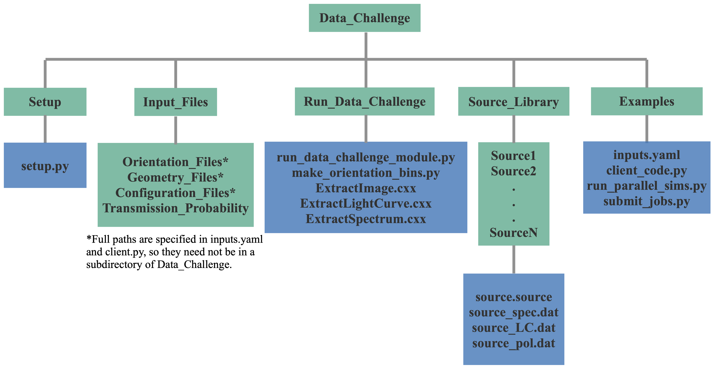

# COSI Data Challenge

## Required Software  
The data challenge module requires the MEGAlib code, available [here](http://megalibtoolkit.com/home.html). Among other things, MEGAlib simulates the emission from any (MeV) gamma-ray source, simulates the instrument response, performs the event reconstruction, and performs the high-level data analysis. See the above link for more details regarding the MEGAlib package.   

## Getting Help  
For any help/problems with running the data challenge module please contact me at: ckarwin@clemson.edu. 

## Data Products  
All final data products for the data challenge are available on the COSI sftp account.

## Purpose  
The main purpose of this repository is to simulate the all-sky data that will be observed by COSI. The primary code in this folder is **run_data_challenge_module.py**, which can be called with **client_code.py**, with the main input parameters passed via **inputs.yaml**. Additionally, parallel simulations with different time bins can be ran using **run_parellel_sims.py**. The modules can be ran directly from the command line, or submitted to a batch system, which allows them to be easily employed for generating multiple/long simulations. 

## Directory Structure  
The schematic below shows the directory structure. Full installation instructions and a quickstart guide are given below. The turquoise boxes represent directories, and the blue boxes represent the contents of the given directory. The main directory (**Data_Challenge**) is provided above.  

## Available Sources for Simulations  
The simulated sources are passed via the inputs.yaml file. The following sources are available:

**Point Sources:**   
crab  
vela   
cenA  
cygX1  
DataChallenge1: crab, vela, cenA, and cygX1  

**Diffuse:**   
Al26  
Al26_10xFlux  
GC511A (based on Knoedlseder+05)  
GC511A_10xFlux  
GC511B (based on Skinner+14)  
GalBrem  
GalIC

**Background:**   
LingBG  

## Quickstart Guide   
<pre>
1. Download Data_Challenge directory:
  - git clone https://github.com/ckarwin/COSI.git
  - It's advised to add the Run_Data_Challenge directory to your python path.
  - Note: This repository does not include the geometery file. 

2. Setup source library with proper paths:
     
     cd full/path/Data_Challenge/Setup
     python setup.py
     
  - Note: the default transmission probability file is calculated for 33 km.
     
3. The Examples directory contains all the scripts needed to run the code </b> 
  - For any new analysis (assuming you added your path), copy the following files to a new analysis directory: client_code.py, inputs.yaml, run_parallel_sims.py, and submit_jobs.py.

4. Specify inputs in inputs.yaml </b>
  - For the orientation file use: AllData.ori found in full/path/Data_Challenge/Input_Files/Orientation_Files/COSI_2016_Balloon_Flight
  
5. To run the code:  </b>
  - Uncomment the functions inside the client code that you want to run.
  - Note: configuration files are specified in the client code and can be found in full/path/Data_Challenge/Input_Files/Configuration_Files/Data_Challenges/Data_Challenge_1
  - The code can be ran directly from the terminal or submitted to a batch system.
  - To run from the terminal use python client_code.py.
  - To run parallel jobs in cosima with numerous time bins use python run_parallel_sims.py. 
  - To run a single job in cosima with one time bin use python submit_jobs.py. 

6. If running parallel jobs:
  - Need to specify name, orientation_file, and num_sims in run_parallel_sims.py. 
  - In the client code uncomment all functions except mimrec.
  - Run: python run_parallel_sims.py.  
  - After all the jobs finish, change directory to Main_Output, uncomment just the mimrec function in the client code, then run: python submit_jobs.py.
 
7. Note that the scripts found in the Examples directory are starting templates for running the module. They may need to be modified.

</pre>

## Best Practices for Adding New Sources  
* New sources should be added to Source_Library.  
* Use Source_Library/crab as a template to follow. See the MEGAlib cosima documentation for more details regarding the inputs.  
* Define a directory for the source using its simple name (i.e. src_name). The same name must be used for all files in the directory.  
* At minimum the source directory needs to contain a source file (src_name.source) and a spectral file (src_name.dat). In the future it may also include a light curve file and a polarization file.  
* The source also needs to be added to master_source_list.txt in Source_Library.
* Alternatively, send me the source name, position, and spectra, and I can add it to the library.

## Data Challenge Notes  
**Data Challenge 1:** A brief summary of the first data challenge is available [here](https://drive.google.com/file/d/1GeR5tNGInuIbDskCUN7_H5Pynptr_-Gj/view?usp=sharing) (please request access if needed).
