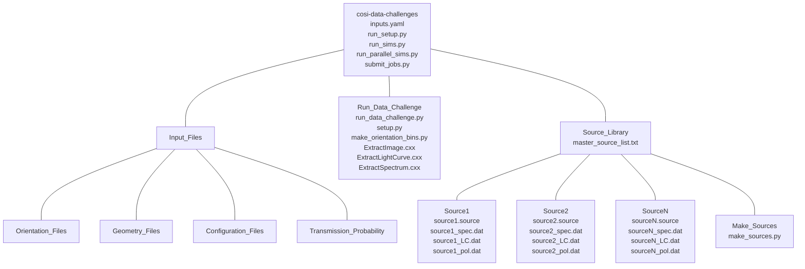

# COSI Data Challenge

## Required Software  
The data challenge module requires the MEGAlib code, available [here](http://megalibtoolkit.com/home.html). Among other things, MEGAlib simulates the emission from any (MeV) gamma-ray source, simulates the instrument response, performs the event reconstruction, and performs the high-level data analysis. See the above link for more details regarding the MEGAlib package.   

## Getting Help  
For any help/problems with running the data challenge module please contact Chris Karwin at: christopher.m.karwin@nasa.gov. 

## Data Products  
All final data products for the data challenge are available on the COSI sftp account.

## Purpose  
The main purpose of this repository is to simulate the all-sky data that will be observed by COSI. The primary code is **run_data_challenge_module.py**, which can be called with **run_sims.py**, with the main input parameters passed via **inputs.yaml**. Additionally, parallel simulations with multiple time bins can be ran using **run_parellel_sims.py**, which distributes the time bins to seperate compute nodes. The pipeline also supports the use of mcosima with numerous cores per compute node. The modules can be ran directly from the command line, or submitted to a batch system, which allows them to be easily employed for generating multiple/long simulations. 

## Directory Structure  
The schematic below shows the directory structure. Full installation instructions and a quickstart guide are given below.   

## Available Sources for Simulations  
The simulated sources are passed via the inputs.yaml file. The following sources are available:

**Point Sources:**   
crab  
crab_10xFlux  
vela   
vela_10xFlux  
cenA  
cenA_10xFlux  
cygX1  
cygX1_10xFlux  

**Diffuse:**   
Al26  
Al26_10xFlux  
GC511A (based on Knoedlseder+05)  
GC511A_10xFlux  
GC511B (based on Skinner+14)  
GalBrem  
GalIC  
GalTotal_SA100_F98  

**Background:**   
LingBG  

## Quickstart Guide   
<pre>
1. Download cosi-data-challenges directory:
  - git clone https://github.com/cositools/cosi-data-challenges.git
  - Add the Run_Data_Challenge directory to your python path.
  - Note: This repository does not include the geometery file. 

2. For any new analysis, copy the following files to a new analysis directory: inputs.yaml, run_setup.py
     
3. Specify inputs in inputs.yaml </b>
     
4. Run setup script: python run_setup.py
  - This will setup the source directory and copy all needed files for running the code.
  
5. To run the code:  </b>
  - Uncomment the functions inside run_sims.py that you want to run.
  - The code can be ran directly from the terminal or submitted to a batch system.
  - To run from the terminal use python run_sims.py.
  - To run parallel jobs in cosima with numerous time bins use python run_parallel_sims.py. 
  - To submit a single job use python submit_jobs.py. 

6. If running parallel jobs:
  - In run_sims.py uncomment all functions except mimrec.
  - Run: python run_parallel_sims.py.  
  - After all the jobs finish, uncomment just the mimrec function in run_sims.py, then run: python submit_jobs.py.

7. Note that the batch submission commands in run_parallel_sims.py and submit_jobs.py may need to be modified based on the user's specific batch system.

</pre>

## Bug report  
* The number of iterations in ExtractImage.cxx needs to be changed manually if using a different value than the default (20). Specifically, this is at lines 8 and 10. For x iterations: 20 --> x and 22 --> x+2. This will be automated soon.  
